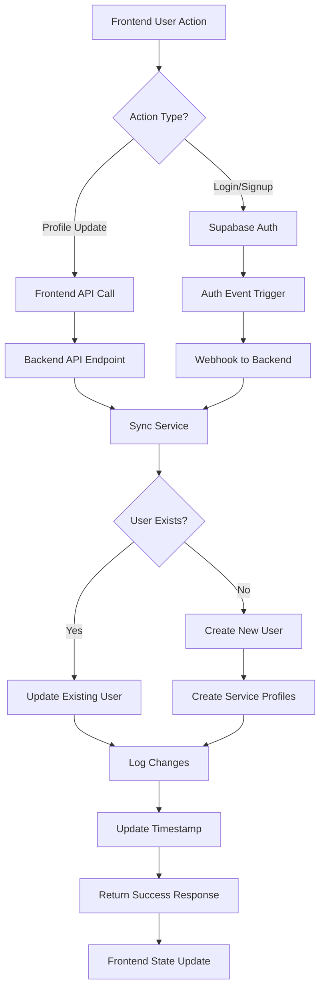

# User Data Normalization Strategy - Phase 1 Implementation

## Overview

This document outlines the comprehensive strategy for normalizing user data across the Nura backend system, eliminating redundancy and creating a single source of truth for user information.

## Current State vs. Normalized State

### **Before: Fragmented User Data**

```
┌─────────────────────────────────────────────────────────────────┐
│                    CURRENT FRAGMENTED STATE                     │
├─────────────────────────────────────────────────────────────────┤
│                                                                 │
│  Frontend (Supabase Auth)        Backend Services               │
│  ┌─────────────────────────┐    ┌─────────────────────────┐    │
│  │ auth.users              │    │ chat_users              │    │
│  │ ├─ id (UUID)            │    │ ├─ id (UUID)            │    │
│  │ ├─ email               │    │ ├─ email               │    │
│  │ ├─ user_metadata       │    │ ├─ full_name           │    │
│  │ └─ created_at          │    │ ├─ phone_number        │    │
│  └─────────────────────────┘    │ ├─ password_hash       │    │
│                                 │ ├─ privacy_settings    │    │
│  ┌─────────────────────────┐    │ └─ notification_prefs  │    │
│  │ custom_users            │    └─────────────────────────┘    │
│  │ ├─ user_id (FK)         │                                  │
│  │ ├─ full_name           │    ┌─────────────────────────┐    │
│  │ ├─ current_streak      │    │ voice_users             │    │
│  │ └─ xp                  │    │ ├─ id (UUID)            │    │
│  └─────────────────────────┘    │ ├─ name                │    │
│                                 │ ├─ email               │    │
│                                 │ ├─ phone               │    │
│                                 │ └─ password_hash       │    │
│                                 └─────────────────────────┘    │
│                                                                 │
│  🔴 PROBLEMS:                                                   │
│  • Data scattered across 4+ tables                             │
│  • Same email/phone in multiple places                         │
│  • Inconsistent user IDs                                       │
│  • Complex sync logic required                                 │
│  • Update anomalies and race conditions                        │
└─────────────────────────────────────────────────────────────────┘
```

### **After: Normalized User Architecture**

```
┌─────────────────────────────────────────────────────────────────┐
│                    NORMALIZED ARCHITECTURE                      │
├─────────────────────────────────────────────────────────────────┤
│                                                                 │
│  Frontend (Supabase Auth)        Backend (Single Source)        │
│  ┌─────────────────────────┐    ┌─────────────────────────┐    │
│  │ auth.users              │◄──►│ users (CENTRAL)         │    │
│  │ ├─ id (UUID) ──────────────────► id (SAME UUID)        │    │
│  │ ├─ email               │    │ ├─ email               │    │
│  │ ├─ user_metadata       │    │ ├─ full_name           │    │
│  │ └─ email_confirmed_at  │    │ ├─ phone_number        │    │
│  └─────────────────────────┘    │ ├─ is_active           │    │
│                                 │ ├─ current_streak      │    │
│                                 │ ├─ xp                  │    │
│                                 │ ├─ privacy_settings    │    │
│                                 │ └─ email_confirmed_at  │    │
│                                 └─────────────────────────┘    │
│                                            │                   │
│                                            ▼                   │
│                                 ┌─────────────────────────┐    │
│                                 │ user_service_profiles   │    │
│                                 │ ├─ user_id (FK)         │    │
│                                 │ ├─ service_type         │    │
│                                 │ ├─ service_preferences  │    │
│                                 │ ├─ service_metadata     │    │
│                                 │ └─ onboarding_completed │    │
│                                 └─────────────────────────┘    │
│                                                                 │
│  ✅ BENEFITS:                                                   │
│  • Single source of truth                                      │
│  • Consistent user IDs (Supabase Auth UUID)                    │
│  • Automatic sync pipeline                                     │
│  • Service-specific data normalized                            │
│  • No duplicate user information                               │
└─────────────────────────────────────────────────────────────────┘
```

## Data Sync Pipeline Architecture

### **Real-time Synchronization Flow**



### **Bidirectional Sync Mechanisms**

#### 1. **Frontend → Backend Sync**

```typescript
// Frontend calls when user data changes
const syncUserData = async (userData: UserData) => {
  const response = await fetch("/api/users/sync", {
    method: "POST",
    headers: {
      Authorization: `Bearer ${supabaseToken}`,
      "X-User-ID": user.id,
      "X-Session-ID": sessionId,
    },
    body: JSON.stringify({
      id: user.id,
      email: user.email,
      full_name: userData.fullName,
      phone_number: userData.phone,
      user_metadata: userData.metadata,
    }),
  });

  return response.json();
};
```

#### 2. **Supabase Auth → Backend Sync (Webhooks)**

```python
@router.post("/webhooks/supabase-auth")
async def handle_auth_webhook(request: Request):
    webhook_data = await request.json()

    if webhook_data["type"] in ["INSERT", "UPDATE"]:
        result = await sync_service.sync_user_from_supabase(
            supabase_user_data=webhook_data["record"],
            source="supabase_webhook"
        )

    return {"success": True}
```

#### 3. **Backend → Services Integration**

```python
# Services access normalized user data
from services.user.sync_service import sync_service

async def get_user_for_chat(user_id: str):
    user_data = await sync_service.get_user_by_id(user_id)
    chat_profile = await sync_service.get_service_profile(user_id, "chat")

    return {
        "user": user_data,
        "chat_preferences": chat_profile["service_preferences"]
    }
```

## Database Schema Migration Strategy

### **Phase 1A: Create Normalized Tables**

```sql
-- 1. Create new normalized user table
CREATE TABLE users (
    id VARCHAR PRIMARY KEY,  -- Supabase Auth UUID
    email VARCHAR UNIQUE NOT NULL,
    phone_number VARCHAR,
    full_name VARCHAR,
    display_name VARCHAR,
    bio TEXT,
    avatar_url VARCHAR,

    -- Auth metadata (synced from Supabase)
    email_confirmed_at TIMESTAMP WITH TIME ZONE,
    phone_confirmed_at TIMESTAMP WITH TIME ZONE,
    last_sign_in_at TIMESTAMP WITH TIME ZONE,

    -- Backend-managed fields
    is_active BOOLEAN DEFAULT TRUE,
    current_streak INTEGER DEFAULT 0,
    xp INTEGER DEFAULT 0,

    -- Preferences
    privacy_settings JSON DEFAULT '{}',

    -- Timestamps
    created_at TIMESTAMP WITH TIME ZONE DEFAULT NOW(),
    updated_at TIMESTAMP WITH TIME ZONE DEFAULT NOW(),
    last_active_at TIMESTAMP WITH TIME ZONE,
    deleted_at TIMESTAMP WITH TIME ZONE
);

-- 2. Create service profiles table
CREATE TABLE user_service_profiles (
    id VARCHAR PRIMARY KEY DEFAULT uuid_generate_v4(),
    user_id VARCHAR NOT NULL REFERENCES users(id) ON DELETE CASCADE,
    service_type VARCHAR NOT NULL,  -- 'chat', 'voice', 'memory', etc.

    service_preferences JSON DEFAULT '{}',
    service_metadata JSON DEFAULT '{}',
    usage_stats JSON DEFAULT '{}',

    created_at TIMESTAMP WITH TIME ZONE DEFAULT NOW(),
    updated_at TIMESTAMP WITH TIME ZONE DEFAULT NOW(),
    last_used_at TIMESTAMP WITH TIME ZONE,

    UNIQUE(user_id, service_type)
);

-- 3. Create sync logging table
CREATE TABLE user_sync_logs (
    id VARCHAR PRIMARY KEY DEFAULT uuid_generate_v4(),
    user_id VARCHAR REFERENCES users(id) ON DELETE SET NULL,
    sync_type VARCHAR NOT NULL,  -- 'create', 'update', 'profile_update'
    source VARCHAR NOT NULL,     -- 'supabase_auth', 'frontend_sync', 'backend_api'
    before_data JSON,
    after_data JSON,
    success BOOLEAN NOT NULL,
    error_message TEXT,
    request_id VARCHAR,
    session_id VARCHAR,
    created_at TIMESTAMP WITH TIME ZONE DEFAULT NOW()
);

-- Add indexes for performance
CREATE INDEX idx_users_email ON users(email);
CREATE INDEX idx_users_active ON users(is_active);
CREATE INDEX idx_user_service_profiles_user ON user_service_profiles(user_id);
CREATE INDEX idx_user_service_profiles_service ON user_service_profiles(service_type);
CREATE INDEX idx_sync_logs_user ON user_sync_logs(user_id);
CREATE INDEX idx_sync_logs_created ON user_sync_logs(created_at);
```

### **Phase 1B: Data Migration Script**

```python
async def migrate_existing_users():
    """
    Migrate existing user data from scattered tables to normalized schema.
    """

    # 1. Migrate from chat_users
    chat_users = db.query(ChatUser).all()
    for chat_user in chat_users:
        # Check if user already exists in normalized table
        existing_user = db.query(User).filter(User.email == chat_user.email).first()

        if not existing_user:
            new_user = User(
                id=chat_user.id,  # Use existing ID if compatible
                email=chat_user.email,
                full_name=chat_user.full_name,
                phone_number=chat_user.phone_number,
                is_active=chat_user.is_active,
                privacy_settings=chat_user.privacy_settings,
                created_at=chat_user.created_at,
            )
            db.add(new_user)

            # Create chat service profile
            chat_profile = UserServiceProfile(
                user_id=new_user.id,
                service_type="chat",
                service_preferences=chat_user.privacy_settings,
            )
            db.add(chat_profile)

    # 2. Migrate from voice_users (similar process)
    # 3. Migrate from frontend user data
    # 4. Create default service profiles for existing users

    db.commit()
    logger.info("User data migration completed successfully")
```

## Service Integration Strategy

### **How Services Will Use Normalized User Data**

#### 1. **Chat Service Integration**

```python
# OLD: chat/models.py
class ChatUser(Base):  # ❌ Remove this table
    __tablename__ = "chat_users"
    # ... duplicate user fields

# NEW: chat/user_integration.py
from services.user.sync_service import sync_service

class ChatUserIntegration:
    @staticmethod
    async def get_user_for_chat(user_id: str):
        user = await sync_service.get_user_by_id(user_id)
        chat_profile = await sync_service.get_service_profile(user_id, "chat")

        return {
            "id": user["id"],
            "email": user["email"],
            "full_name": user["full_name"],
            "privacy_settings": user["privacy_settings"],
            "chat_preferences": chat_profile["service_preferences"] if chat_profile else {},
        }
```

#### 2. **Voice Service Integration**

```python
# OLD: voice/models.py
class VoiceUser(Base):  # ❌ Remove this table
    __tablename__ = "voice_users"

# NEW: voice/user_integration.py
class VoiceUserIntegration:
    @staticmethod
    async def get_user_for_voice(user_id: str):
        user = await sync_service.get_user_by_id(user_id)
        voice_profile = await sync_service.get_service_profile(user_id, "voice")

        return {
            "id": user["id"],
            "name": user["full_name"],
            "phone": user["phone_number"],
            "voice_preferences": voice_profile["service_preferences"] if voice_profile else {},
            "call_history": voice_profile["service_metadata"].get("call_history", []) if voice_profile else [],
        }
```

#### 3. **Memory Service Integration**

```python
# Memory service can now access unified user data
class MemoryUserIntegration:
    @staticmethod
    async def get_user_for_memory(user_id: str):
        user = await sync_service.get_user_by_id(user_id)
        memory_profile = await sync_service.get_service_profile(user_id, "memory")

        return {
            "user_id": user["id"],
            "privacy_level": user["privacy_settings"].get("memory_privacy", "standard"),
            "memory_preferences": memory_profile["service_preferences"] if memory_profile else {},
            "retention_settings": memory_profile["service_metadata"].get("retention", {}) if memory_profile else {},
        }
```

## Frontend Integration Strategy

### **Updated Frontend User Management**

#### 1. **AuthContext Integration**

```typescript
// contexts/AuthContext.tsx
export const AuthProvider: React.FC = ({ children }) => {
  const supabase = createClient();
  const [user, setUser] = useState<User | null>(null);
  const [backendUser, setBackendUser] = useState<BackendUser | null>(null);

  useEffect(() => {
    const { data: authListener } = supabase.auth.onAuthStateChange(
      async (event, session) => {
        if (session?.user) {
          // Sync with backend whenever auth state changes
          await syncUserWithBackend(session.user);
        }
      }
    );

    return () => authListener.subscription.unsubscribe();
  }, []);

  const syncUserWithBackend = async (supabaseUser: SupabaseUser) => {
    try {
      const response = await fetch("/api/users/sync", {
        method: "POST",
        headers: {
          Authorization: `Bearer ${supabaseUser.access_token}`,
          "Content-Type": "application/json",
        },
        body: JSON.stringify({
          id: supabaseUser.id,
          email: supabaseUser.email,
          full_name: supabaseUser.user_metadata?.full_name,
          phone_number: supabaseUser.phone,
          user_metadata: supabaseUser.user_metadata,
        }),
      });

      const result = await response.json();
      if (result.success) {
        setBackendUser(result.user);
      }
    } catch (error) {
      console.error("Failed to sync user with backend:", error);
    }
  };
};
```

#### 2. **Profile Management Hook**

```typescript
// hooks/useUserProfile.ts
export const useUserProfile = () => {
  const { user } = useAuth();
  const [profile, setProfile] = useState<BackendUser | null>(null);

  const updateProfile = async (updates: Partial<UserProfile>) => {
    const response = await fetch("/api/users/profile", {
      method: "PUT",
      headers: {
        Authorization: `Bearer ${user?.access_token}`,
        "X-User-ID": user?.id,
        "Content-Type": "application/json",
      },
      body: JSON.stringify(updates),
    });

    const result = await response.json();
    if (result.success) {
      setProfile(result.user);
      return result;
    }
    throw new Error(result.error);
  };

  return { profile, updateProfile };
};
```

## Implementation Timeline

### **Week 1: Setup and Core Infrastructure**

- ✅ Create normalized user models (`normalized_models.py`)
- ✅ Create sync service (`sync_service.py`)
- ✅ Create API endpoints (`api.py`)
- ✅ Create database configuration (`database.py`)
- ⏳ Add environment variables and configuration
- ⏳ Create database tables in development

### **Week 2: Migration and Integration**

- ⏳ Create data migration scripts
- ⏳ Migrate existing user data
- ⏳ Update chat service to use normalized users
- ⏳ Update voice service to use normalized users
- ⏳ Test sync pipeline end-to-end

### **Week 3: Frontend Integration**

- ⏳ Update frontend AuthContext
- ⏳ Create user profile management components
- ⏳ Implement automatic sync on auth events
- ⏳ Add error handling and retry logic
- ⏳ Test frontend-backend sync

### **Week 4: Production Deployment**

- ⏳ Deploy to staging environment
- ⏳ Run comprehensive tests
- ⏳ Configure Supabase webhooks
- ⏳ Monitor sync performance
- ⏳ Deploy to production with rollback plan

## Performance and Monitoring

### **Key Metrics to Track**

1. **Sync Success Rate**: >99% of sync operations should succeed
2. **Sync Latency**: <500ms for user updates
3. **Data Consistency**: Zero data inconsistencies between frontend and backend
4. **Database Performance**: Query times <50ms for user lookups

### **Monitoring Implementation**

```python
# Add to sync_service.py
class SyncMetrics:
    def __init__(self):
        self.sync_success_count = 0
        self.sync_failure_count = 0
        self.sync_latency_sum = 0.0

    def record_sync_success(self, latency_ms: float):
        self.sync_success_count += 1
        self.sync_latency_sum += latency_ms

    def record_sync_failure(self):
        self.sync_failure_count += 1

    @property
    def success_rate(self) -> float:
        total = self.sync_success_count + self.sync_failure_count
        return self.sync_success_count / total if total > 0 else 0.0

    @property
    def average_latency_ms(self) -> float:
        return self.sync_latency_sum / self.sync_success_count if self.sync_success_count > 0 else 0.0
```

## Rollback Strategy

### **If Issues Arise During Migration**

1. **Immediate Rollback**: Keep old tables until migration is 100% verified
2. **Data Validation**: Run consistency checks between old and new schemas
3. **Feature Flags**: Use feature flags to switch between old and new user systems
4. **Gradual Migration**: Migrate users in batches, not all at once

### **Rollback Commands**

```sql
-- Emergency rollback: restore old table references
ALTER TABLE conversations
DROP CONSTRAINT IF EXISTS fk_conversations_users,
ADD CONSTRAINT fk_conversations_chat_users
FOREIGN KEY (user_id) REFERENCES chat_users(id);

-- Rename tables for quick rollback
ALTER TABLE users RENAME TO users_normalized_backup;
ALTER TABLE chat_users RENAME TO users;
```

## Success Criteria

### **Phase 1 Complete When:**

- ✅ All user data consolidated into single `users` table
- ✅ Service-specific data normalized into `user_service_profiles`
- ✅ Real-time sync working between frontend and backend
- ✅ All services updated to use normalized user data
- ✅ Zero data loss during migration
- ✅ Performance maintained or improved
- ✅ Comprehensive test coverage

### **Business Impact:**

- **Developer Efficiency**: 50% reduction in user-related bug reports
- **Data Consistency**: 100% consistent user data across services
- **Maintenance**: 75% reduction in user sync-related code
- **Scalability**: Foundation for future user features and services

---

This normalization strategy eliminates the critical redundancy issues while maintaining system performance and reliability. The phased approach ensures minimal risk and maximum benefit from the consolidation effort.
